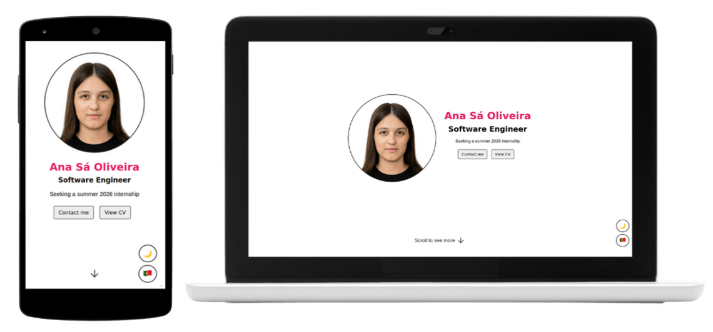

# Portfolio Website 💻💼
## Personal Project

This is my portfolio website built to showcase my work, skills and projects.

[ana.is-a.dev](https://ana.is-a.dev/)

## Things I Plan to Do (If I have time and motivation)
- [ ] Update the skills section
- [ ] Update CV
- [ ] Update the projects section
- [ ] Decide the contact section content
- [ ] Automatic screenshot of the CV everytime I update it (instead of manually updating the image)
- [ ] Fix scroll bug
- [ ] Fix layout shift issue
- [ ] Handle image load failures
- [ ] Clean up the codebase

## Notes
1. I’ll do my best to keep this website updated.
2. This website is never really finished because it changes as I do. (It’s a portfolio, duh!)

## Support
1. If you find any bugs or have any suggestions, feel free to reach out!
2. If you like my website, don’t forget to star this repository! ⭐